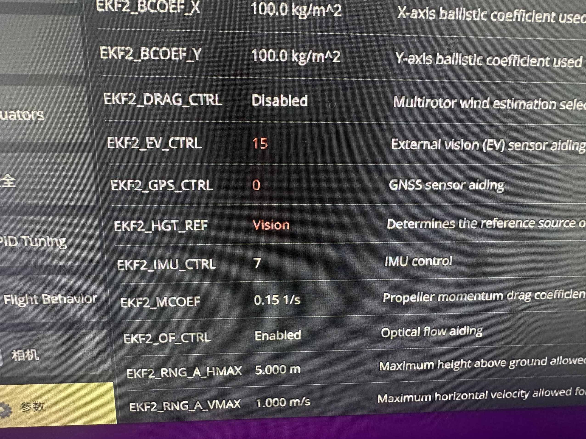

<!--
 * @@Descripttion: 
 * @@version: 
 * @@encoding: utf-8
 * @@Author: qiurongcan
 * @Date: 2025-12-04 16:23:54
 * @LastEditTime: 2025-12-04 18:29:05
-->
# px4_gazebo_fuel_sim

本仓库基于PX4和gazebo的仿真环境下，使用fastlio定位以及fuel未知环境自主探索路径算法

## 仿真环境

| 名称     | 具体版本                                   |
| :------- | :----------------------------------------- |
| 操作系统 | Ubuntu20.04                                |
| ROS      | ROS1 Noetic                                |
| Gazebo   | Gazebo11                                   |
| PX4      | v1.14.0(这个版本不影响，配置上有略微区别） |
| 传感器   | Mid360                                     |
| 定位算法 | Fast LIO2                                  |
| 搜索算法 | FUEL                                       |

## PX4+MID360配置

参考仓库 `https://github.com/qiurongcan/Mid360_px4.git`中的配置方法进行配置，详细阅读

**配置完成后**
```shell
# 这里默认无人机型号在mavros_posix_sitl.launch文件中替换成了iris_mid360
roslaunch px4 mavrox_posix_sitl.launch
```

## FAST LIO2配置
可以参考Fast LIO原仓库`https://github.com/hku-mars/FAST_LIO.git`进行配置，但是编译会有些报错，自己自行解决即可  

如果觉得麻烦可以直接复制本仓库中的`FASTLIO`到工作空间下
```shell
mkdir -p ~/catkin_ws/src
# 目前设定是已经将FASTLIO复制到 ~/catkin_ws/src 目录下
cd ~/catkin_ws
catkin_make
source ./devel/setup.bash
```
```shell
# 如果在真机部署，或者觉得太卡了，在mapping_mid360.launch中将rviz设置为false
roslaunch fast_lio mapping_mid360.launch
```


## FASTLIO为PX4无人机提供定位源
这个节点的作用是转化FastLIO输出的`/Odometry`话题为`/mavros/vision_pose/pose`，给px4提供无GPS情况下的定位  
### QGC参数设置
**v1.14.0（包括）之后的版本**  
|参数|设置|备注|
|:---|:---|:---|
|EKF2_HGT_REF|Vision||
|EKF2_GPS_CTRL| 0 |有GPS的情况下设置为0|
|EKF2_EV_CTRL|15|

**如下图所示**


**v1.14.0（不包括)之前的版本**
|参数|设置|
|:---|:---|
|EKF2_HGT_MODE|Vision|
|EKF2_AID_MASK|24|
```shell
mkdir -p ~/catkin_ws/src
cd ~/catkin_ws/
# 将仓库中的camera_pose_node这个文件夹复制到 ~/catkin_ws/src 目录下
catkin_make
source devel/setup.bash
```
```shell
# 打开一个新的终端
roslaunch camera_pose_node pose_tf.launch
```
## 无人机自动起飞（仿真环境）

## FUEL配置
将这个仓库中的`FUEL` 文件夹复制到 `~/catkin_ws/src/`目录下
```shell
cd ~/catkin_ws/
catkin_make
```
**运行代码**
```shell
# 新建第一个终端 运行后出现一个rviz
roslaunch exploration_manger exploration_manger.launch

# 新建第二个终端
rosrun exploration_manger fuel_nav
```
## 致谢
